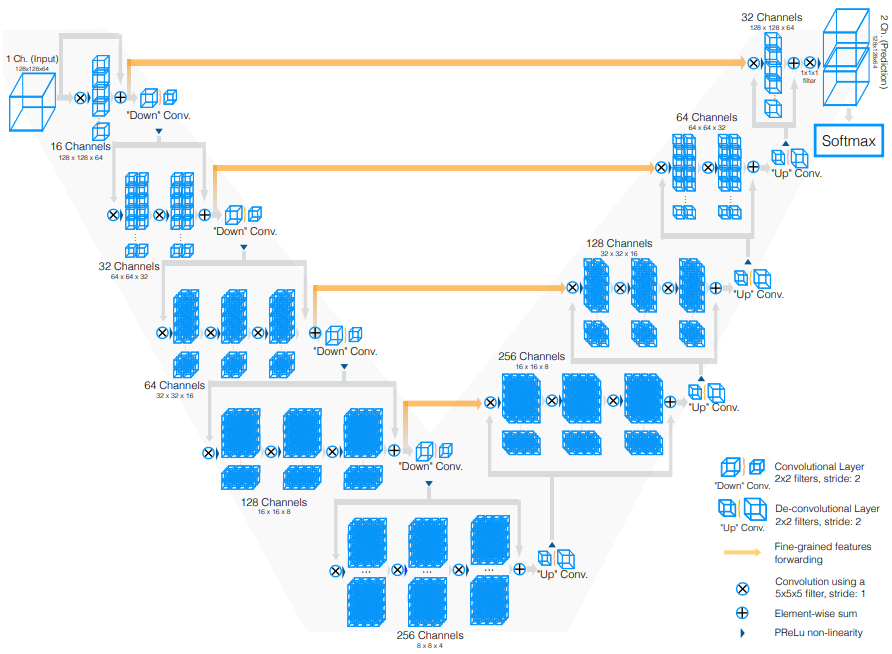
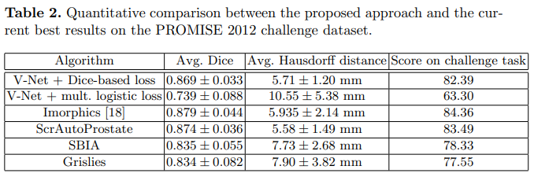
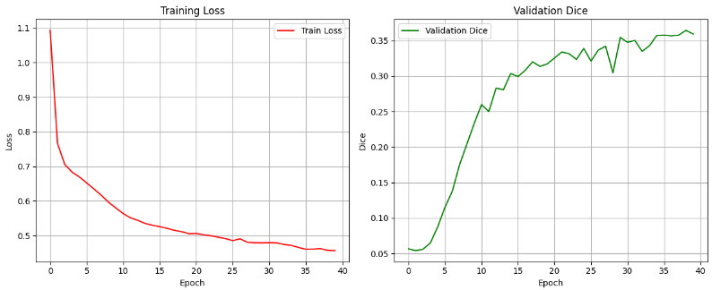
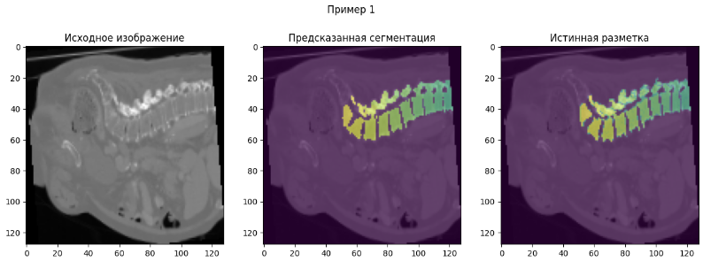
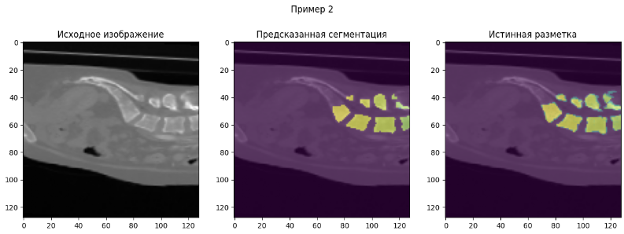
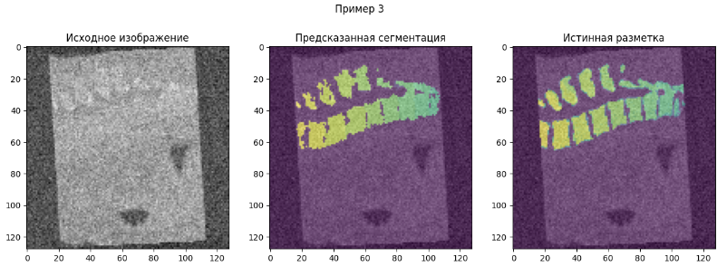
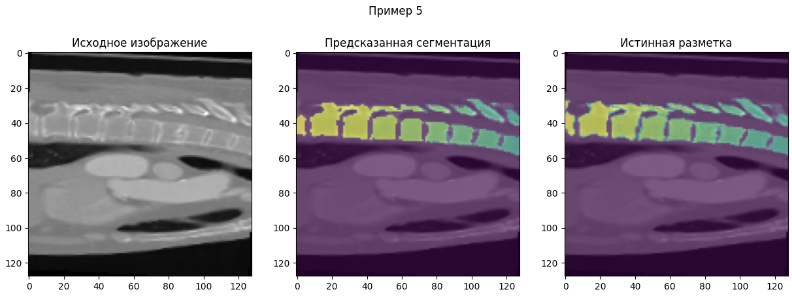
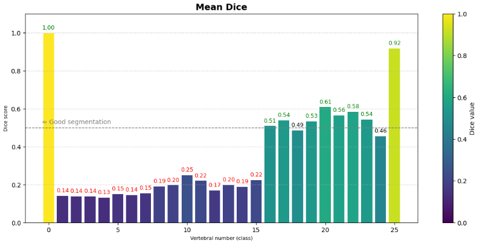

# Spine segmentation

Данный репозиторий посвящен созданию нейронной сети для решения задачи сегментации позвоночника.

## Описание данных

**Обзор**

Этот комплексный набор данных сегментации позвоночника создан на основе набора данных Total Segmentator и тщательно классифицирован по отдельным классам, соответствующим различным сегментам позвонков. Он является бесценным ресурсом для исследователей и специалистов в области медицинской визуализации, особенно тех, кто занимается здоровьем позвоночника.

**Содержание набора данных**

Набор данных содержит 1089 КТ-снимков высокого разрешения, каждый из которых сопровождается профессионально сегментированными файлами nifti. Сегментация ориентирована на позвонки позвоночника, классифицируя их по следующим типам:

**Шейные позвонки:** C1, C2, C3, C4, C5, C6

**Грудные позвонки:** T1, T2, T3, T4, T5, T6, T7, T8, T9, T10, T11, T12

**Поясничные позвонки:** L1, L2, L3, L4, L5

**Крестцовые позвонки:** S1

Этот набор данных служит важным инструментом для разработки и оценки алгоритмов сегментации в медицинской визуализации. Он может использоваться в различных приложениях, таких как автоматизированные диагностические системы, анатомические исследования и передовые методы мониторинга состояния позвоночника.

__Ссылка на источник:__ https://www.kaggle.com/datasets/pycadmk/spine-segmentation-from-ct-scans/data

## Обоснование выбора архитектуры модели

Так как при решении задачи мы пользуемся 3D данными (имеющееся GPU позволяет обучать нейросети на 3D), выбирались архитектуры, позволяющие решать задачу многоклассовой классификации на 3D данных. Эксперимент проводился с архитектурой **V-Net** (https://github.com/faustomilletari/VNet/tree/master). На рисунке выше можно увидеть схематичное изображение архитектуры V-Net.

| Архитектура  | Преимущества | Недостатки   | Особенности | Примерный требуемый VRAM (GB) |
|--------------|--------------|--------------|--------------|--------------|
| 3D U-Net| Простая, стабильная| Требовательна к памяти| Расширение классического 2D U-Net в 3D| 8–16 GB |
| V-Net| Полностью свёрточная 3D-сеть с residual-блоками и Dice-loss    | Оптимизирована под медицинскую сегментацию, устойчивее к дисбалансу классов, быстрее сходится     | Чуть сложнее в обучении, чем базовая U-Net     | 8–14 GB |
| 3D ResU-Net| Повышают точность на сложных контурах| Ещё больше памяти, часто переобучаются на малых данных| Добавляют residual-блоки и attention-механизмы к U-Net| 12–24 GB |
| Swin UNETR / TransUNet | Наилучшее качество на больших датасетах| Крайне ресурсоёмкие| Используют трансформеры| ≥16–32+ GB |

Используемые мощности для обучения: __NVIDIA GeForce RTX 3060 (VRAM: 12.88 GB)__. Соответственно, оптимальным вариантом стал выбор архитектуры **V-Net**, так как она обладает небольшим преимуществом перед классической 3D U-Net и при этом требует не так много ресурсов для реализации.

Была изучена статья (https://arxiv.org/pdf/1606.04797) с обзором архитектуры. В статье приводилась сравнительная таблица алгоритмов loss-функций, можно было понять, что лучшим вариантом для loss в V-Net будет использование Dice-based loss. 

Процесс обучения:

## Примеры реализации работы модели

а) Модель хорошо определяет фон снимков от позвоночника

 б) Позвонки 1-15 имеют низкий Dice - модель почти не различает эти позвонки. Это обусловлено маленьким размером шейных позвонков, так как модели труднее различить контуры.

 в) 16-24 позвонки определяются со средним качеством (поясничные позвонки и позвонки, расположенные в нижней части груди). Видно, что на крупных структурах модель работает значительно лучше, особенно в нижней части позвоночника.

 г) 25 позвонок (крестцовый) определяется уверенно.

### **Обращу внимание, что модель недоучилась (по графикам loss и Dice score на валидации видно, что loss на 40 эпохе продолжал падать, при этом Dice медленно рос). Полагаю, что сорока эпох для модели маловато и нужно ее доучить**

## План по развитию проекта для определения патологии - отеохондроз

Для дальнейшего развития проекта необходимо совершить ряд шагов:

а) Дообучить V-Net (хотя бы еще 30 эпох) и дождаться момента, когда Dice loss стабилизируется на валидации. Думаю что можно в перспективе достичь Dice примерно 0.5

б) Так как результаты анализа работы модели показали, что она сильно ошибается на мелких позвонках, можно попробовать реализовать архитектуру 3D ResU-Net или подобные ей, но для этого понадобится больше мощностей.

в) Реализовать архитектуру, которая будет классифицировать каждый позвонок как "здоровый/имеющий патологию".

## Выводы по проекту:

В ходе работы над проектом была реализована и протестирована нейросетевая архитектура V-Net для решения задачи 3D-сегментации позвоночника.

Текущий этап можно считать успешно реализованным прототипом системы автоматической 3D-сегментации позвоночника. Полученные результаты подтверждают применимость архитектуры V-Net в медицинских задачах и закладывают основу для дальнейшего развития проекта в направлении автоматического обнаружения патологий позвоночника.